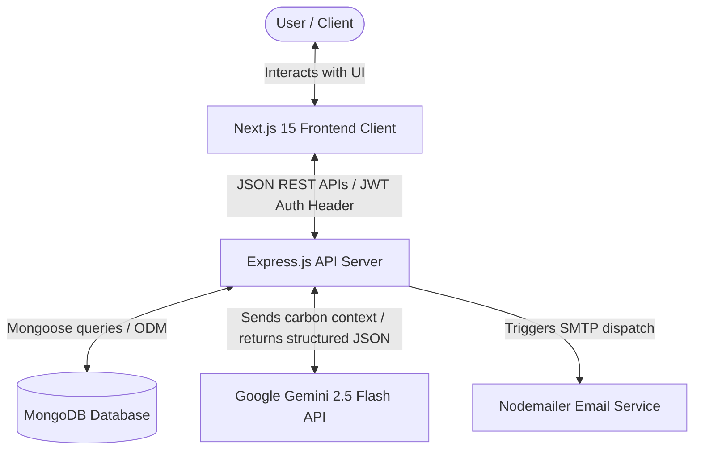

# EcoCarbon | Intelligent Carbon Footprint Awareness Platform

EcoCarbon is a smart, dynamic personal carbon footprint manager designed to help individuals monitor, understand, and reduce their daily environmental impact. Built with a full-stack JavaScript architecture, it connects carbon calculators with personalized AI recommendations and gamification mechanics.

---

## 1. System Architecture Diagram

Below is the high-level architecture diagram showing the flow of data across the EcoCarbon platform:



---

## 2. Chosen Vertical & Focus
- **Vertical**: Climate Action & Personal Sustainability
- **Target Persona**: Individuals looking to build eco-friendly habits and audit their carbon footprint through quantitative logs and qualitative AI coaching.

---

## 3. Approach & Core Logic

### A. Carbon Calculator Math
Emissions are calculated in real-time on the client and logged securely in the database using standard conversion parameters (expressed in kg CO₂):
- **Transport**:
  - `Car`: 0.20 kg CO₂ per km
  - `Motorcycle`: 0.10 kg CO₂ per km
  - `Public Transport`: 0.05 kg CO₂ per km
  - `Bike` / `Walk`: 0.00 kg CO₂ per km
- **Home Energy (Electricity)**: 0.85 kg CO₂ per kWh
- **Food Habits**:
  - `Meat Heavy`: 3.0 kg CO₂ per log
  - `Balanced`: 1.5 kg CO₂ per log
  - `Vegetarian`: 0.7 kg CO₂ per log
  - `Vegan`: 0.4 kg CO₂ per log
- **Waste generated**: 0.50 kg CO₂ per kg of waste

### B. AI Sustainability Coach (Gemini 2.5 Flash)
- Analyzes user's historical emissions (grouped by transport, energy, food, waste).
- Prompts Gemini to return a structured JSON mapping:
  - 3-4 specific actionable recommendations.
  - Difficulty ratings (Easy, Medium, Hard).
  - Target savings metrics (kg CO₂ reduction per month).
  - Encouraging coaching summaries.
- Features a safe mock fallback if no API key is specified.

### C. Gamification & Budgets
- **Green Points**: Earned when logging low carbon activities and completing challenges (e.g. +10 points for a log, +15 for green transport, +100 for joining/completing "No Plastic Week").
- **Badges**: Awarded dynamically at points milestones:
  - 🌱 *Green Beginner* (1 point)
  - 📉 *Carbon Saver* (105 points)
  - 🛡️ *Eco Warrior* (500 points)
  - 🏆 *Sustainability Champion* (1000 points)
- **Carbon Budgets**: Allow users to configure target budget emission ceilings, calculating actual consumed ratios dynamically from records.

---

## 4. API Endpoints Documentation

All API routes are prefixed with `/api`.

### Authentication Endpoints (`/api/auth`)

| Endpoint | Method | Access | Description | Payload Example / Response |
|----------|--------|--------|-------------|----------------------------|
| `/auth/register` | `POST` | Public | Initiates registration & sends OTP code to email. | `{"name": "Ava", "email": "ava@example.com", "password": "Password123!"}` |
| `/auth/register/verify` | `POST` | Public | Verifies registration OTP and creates account. | `{"email": "ava@example.com", "otp": "123456"}` |
| `/auth/login` | `POST` | Public | Validates user password & sends 2FA verification OTP. | `{"email": "ava@example.com", "password": "Password123!"}` |
| `/auth/login/verify` | `POST` | Public | Verifies 2FA OTP and issues session token. | `{"email": "ava@example.com", "otp": "654321"}` |
| `/auth/google` | `POST` | Public | Authenticates user using Google ID token or simulation. | `{"token": "g-token", "name": "Ava", "email": "ava@example.com"}` |
| `/auth/profile` | `GET` | Private | Returns authorized user points, role, and badges. | Headers: `Authorization: Bearer <JWT>` |

### Carbon Logging Endpoints (`/api/carbon`)

| Endpoint | Method | Access | Description | Payload Example |
|----------|--------|--------|-------------|-----------------|
| `/carbon/log` | `POST` | Private | Logs a new lifestyle activity and returns calculations. | `{"transportType": "Car", "distance": 10, "electricityUnits": 5, "waterUsage": 20, "foodType": "Vegetarian", "wasteGenerated": 1}` |
| `/carbon/logs` | `GET` | Private | Fetches user activity logs sorted by date descending. | Headers: `Authorization: Bearer <JWT>` |
| `/carbon/stats` | `GET` | Private | Gets aggregated totals grouped by emissions category. | Headers: `Authorization: Bearer <JWT>` |

### Goals & Budgets Endpoints (`/api/goals`)

| Endpoint | Method | Access | Description | Payload Example |
|----------|--------|--------|-------------|-----------------|
| `/goals` | `GET` | Private | Retrieves active budget goals with computed live values. | Headers: `Authorization: Bearer <JWT>` |
| `/goals` | `POST` | Private | Creates a new emission budget target ceiling (kg). | `{"targetEmission": 250}` |
| `/goals/:id` | `PUT` | Private | Updates target emission value or complete status. | `{"status": "COMPLETED"}` |
| `/goals/:id` | `DELETE` | Private | Deletes the specified budget goal. | Headers: `Authorization: Bearer <JWT>` |

### Challenges Endpoints (`/api/challenges`)

| Endpoint | Method | Access | Description | Payload Example |
|----------|--------|--------|-------------|-----------------|
| `/challenges` | `GET` | Private | Lists available community eco challenges (auto-seeded). | Headers: `Authorization: Bearer <JWT>` |
| `/challenges/:id/join` | `POST` | Private | Enrolls user into the specified challenge. | Headers: `Authorization: Bearer <JWT>` |
| `/challenges/:id/complete` | `POST` | Private | Finalizes active challenge and awards bonus points. | Headers: `Authorization: Bearer <JWT>` |

### AI Assistant Endpoints (`/api/ai`)

| Endpoint | Method | Access | Description | Response Example |
|----------|--------|--------|-------------|------------------|
| `/ai/recommendations` | `POST` | Private | Compiles logs context and prompts Gemini for tips. | `{"success": true, "data": {"recommendations": [...], "estimatedTotalReduction": 45}}` |

---

## 5. Security & Accessibility Implementations

### Security Measures
- **Helmet**: Enforces secure HTTP headers.
- **Rate Limiting**: Custom rate limiters protect the API from spam and restrict login/registration attempts.
- **Input Sanitization**: Middleware recursively filters request bodies to strip HTML characters (preventing XSS) and removes keys starting with `$` (preventing MongoDB query operator injection).
- **Environment Variables**: Sensitive items are completely restricted to `.env` configurations.

### Accessibility Enhancements
- **Label Associations**: Interactive fields are linked to descriptive text using `id` and `htmlFor`.
- **Keyboard Navigation**: Form inputs, buttons, and navigation blocks support natural Tab flows and focus indicators.
- **Screen Reader Compatibility**: Screen reader titles and `aria-label` tags are applied to icon-only buttons, and decorative icons use `aria-hidden="true"`.
- **Semantic HTML**: Structural outlines use proper `<main>`, `<header>`, `<nav>`, and `<aside>` tags.

---

## 6. How to Run Locally

### Prerequisites
- Node.js (v18+)
- MongoDB running locally (default fallback: `mongodb://127.0.0.1:27017/carbon_footprint`)

### Backend Setup
1. Navigate to `backend/` and write a `.env` file:
   ```env
   PORT=5000
   MONGO_URI=your_mongodb_uri
   JWT_SECRET=your_jwt_secret
   GEMINI_API_KEY=your_gemini_api_key
   ```
2. Install dependencies and start:
   ```bash
   npm install
   npm run start
   ```

### Frontend Setup
1. Navigate to `frontend/`
2. Install dependencies:
   ```bash
   npm install
   ```
3. Run the Next.js development server:
   ```bash
   npm run dev
   ```
4. Open [http://localhost:3000](http://localhost:3000) in your web browser.

---

## 7. Testing Instructions

The backend API is backed by a suite of Jest integration tests. The test suite uses mocked Mongoose models and third-party API configurations so it runs immediately without requiring an active database or internet connection.

To run the test suite:
1. Navigate to the `backend/` directory:
   ```bash
   cd backend
   ```
2. Execute the tests:
   ```bash
   npm run test
   ```
   All 12 tests should run and pass successfully.
